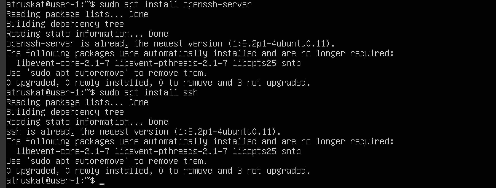
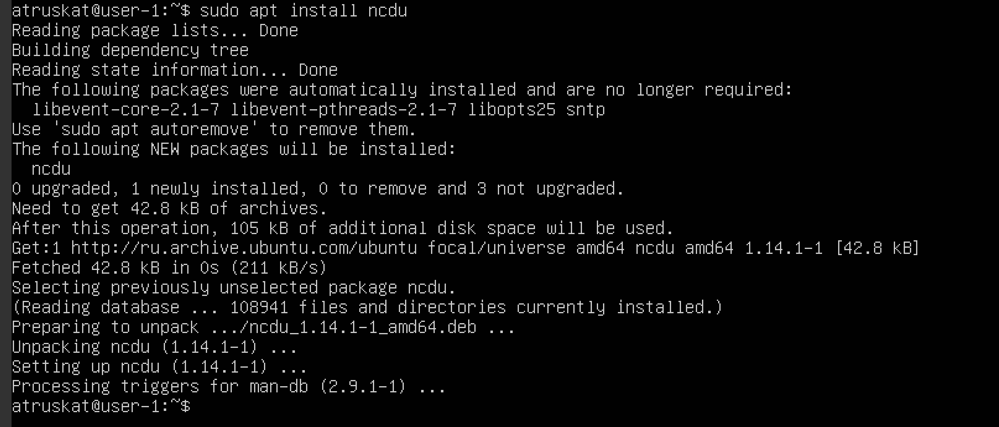

## Part 1. Installation of the OS

- **Install Ubuntu 20.04 Server LTS on VirtualBox**
- **Verification of Ubuntu Version**

    

---

## Part 2. Creating a User

- **Create a New User and Add to `adm` Group**
    ```sh
    sudo useradd adm new_user
    sudo useradd -G adm -s /bin/bash -p 12345 new_user
    ```
    

- **Verify the New User in `/etc/passwd`**
    ```sh
    cat /etc/passwd
    ```
    

---

## Part 3. Setting up the OS Network

### 1. **Set the Machine Name**

- **Command to Set Hostname:**
    ```sh
    sudo hostnamectl set-hostname user-1
    ```

    

### 2. **Set the Time Zone**

- **Command to Set Time Zone:**
    ```sh
    sudo timedatectl set-timezone Europe/Moscow
    ```

    

### 3. **Output the Names of the Network Interfaces**

- **Command to List Network Interfaces:**
    ```sh
    ip a / ip link show / ip -br a show
    ```

    

- **Explanation for the Presence of the `lo` Interface**

    The `lo` interface is the loopback interface. It is a special, virtual network interface that a computer uses to communicate with itself. The IP address for `lo` is typically `127.0.0.1`. It is used primarily for testing and debugging.

### 4. **Get the IP Address from the DHCP Server**

- **Command to Get IP Address:**
    ```sh
    ip --color r / sudo dhclient -v enp0s3
    ```

    

- **DHCP Explanation:**
    DHCP (Dynamic Host Configuration Protocol) is a network management protocol used to automate the process of configuring devices on IP networks. It dynamically assigns IP addresses and other network configuration parameters to devices, allowing them to communicate on the network without needing manual configuration.

### 5. **Define and Display External and Internal IP Addresses of the Gateway**

- **Command to Display Gateway IPs:**
    ```sh
    ip --color route | grep default
    ```

    

    - External IP address of the gateway can be found by:
    ```sh
    curl icanhazip.com
    ```

    

### 6. **Set Static Network Settings**

- **Edit Network Configuration File:**
    ```sh
    sudo nano /etc/netplan/00-installer-config.yaml
    ```

    

    

    ```sh
    sudo netplan apply
    ```
    - Apply network configuration changes.
    - Ensure the changes take effect immediately.
    - Execute with the required administrative privileges.  <p>

    

- **Reboot the Virtual Machine:**
    ```sh
    sudo reboot
    ```
- **Ping Commands:**
    ```sh
    ping 1.1.1.1
    ping ya.ru
    ```

    

---
## Part 4. OS Update

### 1. **Update System Packages**

- **Update Command:**
    ```sh
    sudo apt update && sudo apt-get upgrade -y
    ```

    

---

## Part 5. Using the sudo Command

### 1. **Allow User to Execute `sudo` Command**

- **Add User to `sudo` Group:**
    ```sh
    sudo usermod -aG sudo new_user
    ```
- **Change Hostname:**
    ```sh
    sudo hostnamectl set-hostname new-hostname
    ```

    

- **Purpose of `sudo`:**
    The `sudo` command allows a permitted user to execute a command as the superuser or another user, as specified by the security policy. It is a way to temporarily elevate privileges to perform tasks that require root or administrative permissions. This is useful for managing system settings, installing software, and performing administrative tasks without logging in as the root user, thereby maintaining system security.

---

## Part 6. Installing and Configuring the Time Service

- **Enable and Start the Time Synchronization Service**
    ```sh
    sudo systemctl enable systemd-timesyncd
    sudo systemctl start systemd-timesyncd
    
- **Check Current Time:**
    ```sh
    timedatectl
    ```

- **Check NTP Synchronization:**
    ```sh
    timedatectl show
    ```

    - Expected Output: `NTPSynchronized=yes`

    

---

## Part 7. Installing and Using Text Editors

### 1. Install Text Editors

- **Install VIM, Nano, and Joe**
    ```sh
    sudo apt install vim nano joe
    ```
     

     

### 2. Create a File with Each Editor

#### VIM
    vim test_vim.txt

- Steps to Exit and Save in VIM:
    - Press i to enter insert mode and write your nickname.
    - Press Esc to exit insert mode.
    - Type :wq and press Enter to save and quit.

    

#### Nano
    nano test_nano.txt

- Steps to Exit and Save in Nano:
    - Write your nickname directly.
    - Press Ctrl + O to save the file, press Enter to confirm.
    - Press Ctrl + X to exit.

    

#### Joe
    joe test_joe.txt

- Steps to Exit and Save in Joe:
    - Write your nickname directly.
    - Press Ctrl + K, then X to save and exit.

    

### 3. Edit the File and Exit Without Saving

#### VIM

- Steps to Exit Without Saving in VIM:
    - Press i to enter insert mode and make changes.
    - Press Esc to exit insert mode.
    - Type :q! and press Enter to quit without saving.

    

#### Nano

- Steps to Exit Without Saving in Nano:
    - Make changes directly.
    - Press Ctrl + X to exit, then press N to discard changes.

    

#### Joe

- Steps to Exit Without Saving in Joe:
    - Make changes directly.
    - Press Ctrl + C to exit, then press Y to lose changes.

    

### 4. Search and Replace in Each Editor

For each editor:

- Edit the File to replace a word.
- Search for the word in the file.
- Replace it with another word.

##### VIM

- Steps to Search and Replace in VIM:
    - Press Esc and type :/WordToSearch.
    - To replace, type :%s/WordToReplace/NewWord/g and press Enter.

    
    

##### Nano

- Steps to Search and Replace in Nano:
    - Press Ctrl + W and type the word to search, press Enter.
    - Press Ctrl + \ and type the word to replace, press Enter.

    
    
    

##### Joe

- Steps to Search and Replace in Joe:
    - Press Ctrl + K, then F to search.
    - Press Ctrl + K, then R to replace.

    
    
    
    

---

## Part 8. Installing and basic setup of the SSHD service

### 1. Install the SSHD Service

    sudo apt install openssh-server
    sudo apt install ssh

Installs the OpenSSH server package, which includes the SSH daemon (sshd).




### 2. Enable SSHD Service to Start on Boot

To ensure the SSHD service starts automatically when the system boots:

    sudo systemctl enable ssh

Configures the SSHD service to start automatically on system boot.


### 3. Change the SSHD Port to 2022

Enter the SSHD configuration file to change the port:

    sudo vim /etc/ssh/sshd_config

After making this change, restart the SSHD service to apply the changes:

    sudo systemctl restart ssh


### 4. Show the Presence of the SSHD Process Using ps

To verify that the SSHD process is running:

    ps aux | grep sshd

- ps: Displays currently running processes.
- aux:
  - a: Shows processes for all users.
  - u: Displays the user/owner of the process. (includes user ID and memory usage).
  - x: Shows processes not attached to a terminal.
- | grep sshd: Filters the output to show only lines containing sshd.


### 5. Reboot the System

Reboot the system to ensure all configurations take effect:

    sudo reboot

After the reboot, SSHD should start automatically on port 2022.


### 6. Verify SSHD Listening on Port 2022 Using netstat -tan

To check the SSHD service running on port 2022, use:

    sudo netstat -tan

- -t: Shows TCP connections.
- -a: Displays all active connections and the listening ports.
- -n: Displays addresses and port numbers in numerical form.


### Explanation of netstat -tan 

- Protocol (tcp): The protocol used (TCP).
- Recv-Q/Send-Q: Byte queues for receiving and sending data.
- Local Address (0.0.0.0:22): The local IP address and port number.
- Foreign Address (0.0.0.0:*): The remote IP address and port number (or * for any).
- State (LISTEN): Indicates the port is listening for incoming connections.

- tcp: The protocol used (Transmission Control Protocol).
- 0: The number of bytes in the receive queue.
- 0: The number of bytes in the send queue.
- 0.0.0.0:22: Listening on port 2022 on all available IP addresses (0.0.0.0 indicates any IP address).
- 0.0.0.0:: The destination address (* indicates any IP address).
- LISTEN: Indicates that the port is open and SSHD is waiting for incoming connections.

---

## Part 9: Installing and Using the top and htop Utilities

### 1. Install the top and htop Utilities

    sudo apt install htop


### 2. Run the top Command and Extract Metrics

    top

- Uptime: 32 min.
- Number of Authorized Users: 1 user.
- Total System Load: 0.00, 0.00, 0.00 - the average system load over 1, 5, and 15 minutes.
- Total Number of Processes: 104.
- CPU Load: 0.0 us, 0.0 sy, 0.0 ni, 100.0 id, 0.0 wa, 0.0 hi. 0.0 si, 0.0 st
- Memory Load: 3920.0 total, 3375.0 free, 155.4 used, 389.6 buff/cache
- PID of the Process with the Highest Memory Usage: 1 - %MEM 0.3
- PID of the Process Taking the Most CPU Time: 1499 - %CPU 0.3


### 3. Run the htop Command

    htop

1. Sorted by PID, PERCENT_CPU, PERCENT_MEM, TIME:
- Press F6 and select PID, %CPU, %MEM, or TIME
- PID


- PERCENT_CPU

- PERCENT_MEM

- TIME


2. Filtered for SSHD Process:
- Press fn + F4 and type sshd to filter and display only the sshd processes.


3. Search for the Syslog Process:
- Press fn + F3 and type syslog to search and highlight the syslog process.
- 

4. Add Hostname, Clock, and Uptime Output:
- Press F2 to open the setup menu, navigate to the "Meters" section, and add Hostname, Clock, and Uptime to the display.

- 
- 

---

## Part 10. Using the fdisk utility

### Step 1: Run the fdisk -l Command

    sudo fdisk -l


### Step 2: Identify the Information

    - Hard Disk Name: /dev/sda
    - Disk Capacity: 50 GiB  
    - Number of Sectors: 104 857 600  
    - Swap Size: 3.9 GB


---

## Part 11: Using the df Utility

### Output of the df Command for Root Partition (/):
    sudo df
    sudo df /
- Partition Size: 24 590 672
- Space Used: 7 218 720
- Space Free: 16 097 484
- Percentage Used: 31%

Measurement Unit: Kilobytes (KB)


### Output of the df -Th Command for Root Partition (/):
    sudo df -Th
    sudo df -Th /

- Partition Size: 24G
- Space Used: 6.9G
- Space Free: 16G
- Percentage Used: 31%
- File System Type: ext4


---

## Part 12: Using the du Utility

### Size of Directories in Human-Readable Format:
     sudo du -sh /home
     sudo du -sh /var
     sudo du -sh /var/log
     
- The -s option ensures that you get a summary (total size) of the directory.
- The -h option makes the output human-readable, showing sizes in KB, MB, GB, etc.

    ```
    /home: 92K
    /var: 829M
    /var/log: 29M
    ```


### Size of Each Element in /var/log:
    du -h /var/log/*
     
   - This command will display the size of each file and subdirectory inside /var/log.


---

## Part 13: Installing and Using the `ncdu` Utility

### Step 1: Install the ncdu Utility

Install `ncdu`
```
sudo apt install ncdu
```


### Step 2: Use ncdu to Check Folder Sizes

Run `ncdu` for `/home`, `/var`, and `/var/log`:
```
sudo ncdu /home
sudo ncdu /var
sudo ncdu /var/log
```     

1. **/home directory size**:
   
   

2. **/var directory size**:
   

3. **/var/log directory size**:
   

---

## Part 14: Working with System Logs
```
vim /etc/log/dmesg
```

``` 
vim /etc/log/syslog 
```

```
vim /etc/log/auth.log
```


### Last Successful Login Details:
```
cat /var/log/auth.log | grep systemd-logind
```
- Time: Aug  9 17:40:22
- Username: atruskat
- Login Method: Login


### Restarting SSHd Service:
```
sudo systemctl restart sshd
grep ssh /var/log/auth.log
```


---

## Part 15: Using the CRON Job Scheduler

### Set Up CRON Job:
    crontab -e


- CRON Job: Run uptime every 2 minutes.
- Add a New CRON Job:
```
*/2 * * * * uptime
```
     - */2: Every 2 minutes.
     - * * * * *: Every hour, day, month, and day of the week.
     - uptime: The command to run.


### List of Current CRON Jobs:
- Check that the CRON job has been added:
```
crontab -l
```


### Uptime command:
- Check system logs to find lines about CRON job execution
```
grep -i CRON /var/log/syslog
```


### Remove All CRON Jobs
```
crontab -r
```


- After Removing All Jobs:
```
crontab -l
```


---