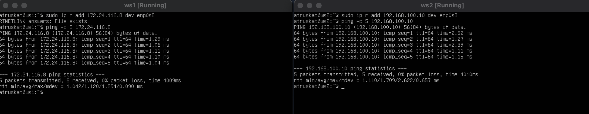
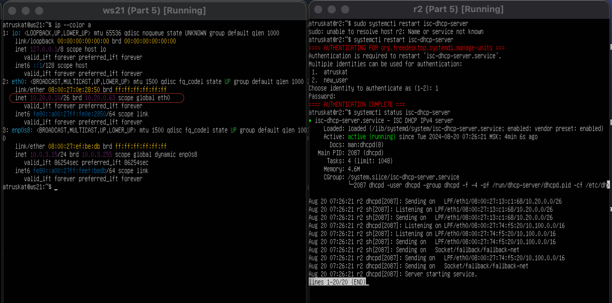
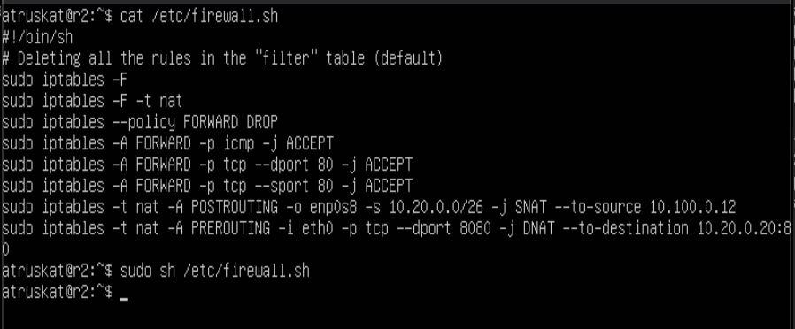
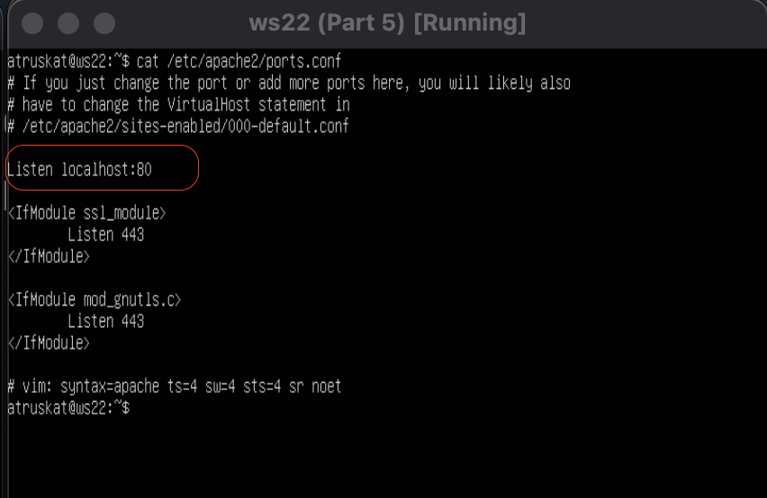

# Linux Network Report

Linux networks configuration on virtual machines.

## Computational Network

A computational network, or an information and computational network (computer network), is a system that facilitates data exchange between computing devices—computers, servers, routers, and other equipment or software. Various data transmission media can be used for information transfer. In addition to a collection of physical devices and physical data transmission means, a computational network can be overlay or virtual, meaning a logically independent dedicated network that uses the resources of another physical network—computational (e.g., the Internet), telephone networks, including PSTN, and/or data transmission environments.

## Classification

There are various classifications of different computational networks based on their purpose and characteristics.

**By geographical spread:**

- **BAN (Body Area Network)**: A network of wearable or implanted computer devices.
- **PAN (Personal Area Network)**: A personal network designed for the interaction of various devices belonging to one owner.
- **LAN (Local Area Network)**: A local network with a closed infrastructure before accessing service providers; it can describe both a small office network and a network of a large plant occupying several hundred hectares; sometimes defined as a network "about six miles (10 km) in radius"; local networks are closed networks, access to which is allowed only to a limited circle of users whose work in such a network is directly related to their professional activities.
- **CAN (Campus Area Network)**: A campus network that combines local networks of closely located buildings.
- **MAN (Metropolitan Area Network)**: City networks between institutions within one or several cities, connecting multiple local area networks.
- **WAN (Wide Area Network)**: A global network covering large geographical regions, including both local area networks and other telecommunications networks and devices. An example of a WAN is packet-switched networks (Frame relay), through which different computer networks can "talk" to each other. Global networks are open and aimed at serving any users.

**By architecture:**

- Client-server
- Peer-to-peer network (decentralized or peer-to-peer network)

**By network topology:**

- Bus
- Ring
- Dual ring
- Star
- Mesh
- Grid
- Tree
- Mixed topology
- Fat Tree

**By transmission medium:**

- Wired (telephone wire, coaxial cable, twisted pair, fiber-optic cable)
- Wireless (information transmission over radio waves in a specific frequency range)

**By functional purpose:**

- Storage network
- Server farm
- Process control network
- SOHO network, home network

**By data transmission speed:**

- Low-speed (up to 10 Mbps)
- Medium-speed (up to 100 Mbps)
- High-speed (over 100 Mbps)

**By network operating systems:**

- Windows-based
- Unix-based
- NetWare-based
- Cisco-based

**By the need to maintain a permanent connection:**

- Packet network, e.g., FidoNet and UUCP
- Online network, e.g., the Internet and GSM

## Overlay Networks

Examples of independent logical computational networks using other physical networks and data transmission environments:

- Dial-up (modem) access
- Virtual private network (VPN) and virtual local area network (VLAN)
- Darknet
- Blockchain

## Protocol Stacks

Various protocol sets can be used when implementing a computer network, some of them include:

- AppleTalk
- ARCNET
- ATM
- DECnet
- Ethernet
- HIPPI
- IEEE-488
- IP
- IPX
- Myrinet
- TCP
- Token Ring
- UDP
- SPX
- FDDI
- QsNet
- USB
- IEEE 1394 (Firewire, iLink)
- X.25
- Frame relay
- Bluetooth
- IEEE 802.11
- Systems Network Architecture
- RapidIO

## Layers

**OSI Network Model:**

- Application layer
- Presentation layer
- Session layer
- Transport layer
- Network layer:
  - Switching
  - Routing
- Data Link layer — The IEEE 802 specification divides this layer into two sub-layers — MAC (Media Access Control) regulates access to the shared physical medium, LLC (Logical Link Control) provides service to the network layer.
- Physical layer

## Data Transmission

**Wired Communication:**

- PSTN (Public Switched Telephone Network)
  - Modem and dial-up access
- Leased lines
- Packet switching
- Frame relay
- PDH
- Ethernet
- RS-232
- Fiber-optic cable transmission:
  - Synchronous optical networking
  - Fiber distributed data interface

**Wireless Communication:**

**Short-range:**

- Bluetooth
- Human Area Network

**Medium-range:**

- IEEE 802.11
- Netsukuku
- IEEE 802.16e WiMAX

**Long-range:**

- Satellite communication
- MMDS
- SMDS
- Data transmission via mobile phones:
  - CSD
  - GPRS
  - HSCSD
  - EDGE
  - UMTS
  - HSDPA
  - HSUPA
  - CDMA
  - LTE
  - IEEE 802.16e WiMAX
  - CDPD
  - Paging networks
  - DataTAC
  - Mobitex
  - Motient

## IP Address

An IP address (Internet Protocol) is a unique numerical identifier of a device in a computer network operating by the IP protocol.

A global uniqueness of the address is required on the Internet; when working in a local network, any uniqueness of the address within the network is required. In IPv4, the IP address is 4 bytes long, and in IPv6, it is 16 bytes long.

### IPv4

In the 4th version, the IP address is a 32-bit number. Usually, the address is written as four decimal numbers ranging from 0 to 255 (equivalent to four 8-bit numbers), separated by dots, for example, 192.168.0.3.

### IPv6

In the 6th version, the IP address is 128-bit. Usually, the address is written as eight four-digit hexadecimal numbers (equivalent to eight 16-bit numbers), separated by colons, for example, 2001:0db8:85a3:0000:0000:8a2e:0370:7334. Leading zeros can be omitted in the record. Consecutive zero groups can be omitted, replaced by a double colon (fe80:0:0:0:0:0:0:1 can be written as fe80::1). More than one such omission in an address is not allowed.

### Structure

An IP address consists of two parts: a network number and a host number. In the case of an isolated network, its address can be chosen by the administrator from specially reserved blocks of addresses for such networks (10.0.0.0/8, 172.16.0.0/12, or 192.168.0.0/16). To access the global network, either an IP from another block of addresses is needed, or a server in the local network must replace the internal IP address (gray) with an external IP address (white), for example: a proxy server, NAT. If the network should operate as a part of the Internet, the network address is issued by the provider or a regional internet registry (RIR). According to IANA, there are five RIRs: ARIN, serving North America, and the Bahamas, Puerto Rico, and Jamaica; APNIC, serving countries in South, East, and Southeast Asia, as well as Australia and Oceania; AfriNIC, serving African countries and the Indian Ocean; LACNIC, serving South American countries and the Caribbean; and RIPE NCC, serving Europe, Central Asia, and the Middle East. Regional registries receive autonomous system numbers and large blocks of addresses from IANA, then issue smaller blocks to local internet registries (LIR), usually large providers.

**IANA** (Internet Assigned Numbers Authority) is the function of managing IP address spaces, top-level domains, and registering MIME data types and other Internet protocols. It is executed by Public Technical Identifiers, which is under the control of ICANN.

The node number in the IP protocol is assigned independently of the local address of the node. A router, by definition, is part of multiple networks. Therefore, each port of a router has its IP address. An end node can also be part of multiple IP networks. In this case, the computer should have multiple IP addresses, corresponding to the number of network connections. Thus, an IP address characterizes not an individual computer or router, but a single network connection.

### Addressing Types

There are two ways to determine how many bits are allocated to the subnet mask and how many to the IP address. Initially, classful addressing (INET) was used, but in the second half of the 1990s, it was replaced by classless addressing (CIDR), where the number of addresses in the network is determined by the subnet mask.

### Comparison

Sometimes you may see an IP address written as "192.168.5.0/24". This type of notation replaces specifying the range of IP addresses. The number after the slash indicates the number of single bits in the subnet mask. For the given example, the subnet mask will be in binary form 11111111 11111111 11111111 00000000 or the same in the router's decimal form: "255.255.255.0". 24 bits of the IP address are allocated for the network number, and the remaining 8 bits of the full address are for the host addresses in this network, the network address, and the network's broadcast address. In summary, 192.168.5.0/24 indicates a range of host addresses from 192.168.5.1 to 192.168.5.254, where 192.168.5.0 is the network address and 192.168.5.255 is the network broadcast address. The following formulas are used to calculate the network address and broadcast address:

**Network Address = IP of any computer on this network AND MASK** (the network address helps determine that computers are on the same network).

**Network Broadcast Address = IP of any computer on this network OR NOT(MASK)** (the network broadcast address is perceived by all computers in the network as an additional personal address, meaning that a packet sent to this address will be received by all hosts in the network as if addressed to them individually. If a packet, not meant for it, arrives at the network interface of a host that is not a packet router, it will be discarded). In some systems, the network address and the broadcast address may be swapped (unverified).*

***The notation of IP addresses with a slash indicating a variable-length subnet mask is also called CIDR, as opposed to the standard notation without the mask, which is also known as INET in UNIX-like operating systems.***

***Special IP Addresses.** In the IP protocol, there are several conventions for the special interpretation of IP addresses: if all binary digits of an IP address are set to 1, then a packet with such a destination address should be broadcast to all nodes on the same network as the source of this packet. This type of broadcast is called a limited broadcast. If the destination node number field contains only ones, then the packet with such an address is broadcast to all nodes in the network with the specified network number. For example, in the network 192.168.5.0 with a subnet mask of 255.255.255.0, a packet with the address 192.168.5.255 is delivered to all nodes in this network. This type of broadcast is called a direct broadcast.*

***Static and Dynamic IP Addresses.** An IP address is called static (permanent, unchangeable) if it is assigned by the user in the device settings or automatically assigned when the device connects to the network and cannot be assigned to another device.*

*An IP address is called dynamic (non-permanent, changeable) if it is automatically assigned when the device connects to the network and is used for a limited period specified in the service that assigned the IP address (DHCP).*

*To obtain an IP address, the client can use one of the following protocols:*

- *BOOTP (RFC 951) — a simple network address configuration protocol previously used for diskless workstations, now supplanted by DHCP.*
- *DHCP (RFC 2131) — the most common network configuration protocol.*
- *IPCP (RFC 1332) as part of the PPP protocol (RFC 1661).*
- *Zeroconf (RFC 3927) — a protocol for network address configuration, name resolution, and service discovery.*
- *RARP (RFC 903) — an obsolete protocol that uses reverse logic (from hardware address to logical) of the still popular ARP protocol in broadcast networks. Does not support mask length propagation (does not support VLSM).*


### Installation

Explanation of the role of each utility listed for network configuration and troubleshooting on Linux systems:

1. **ipcalc**:  
   - **Role**: `ipcalc` is a utility for IP address calculation. It is used to provide network-related information about a given IP address and netmask combination, including the broadcast address, network address, and the range of host addresses.

2. **ip**:  
   - **Role**: The `ip` command is a powerful utility for managing network interfaces, routing tables, and ARP tables. It replaces older utilities like `ifconfig` and `route`, providing a unified approach to network configuration.

3. **netplan**:  
   - **Role**: `netplan` is a utility to configure networking on Ubuntu systems. It allows users to define network interfaces and their configurations using YAML files. `netplan` then translates these configurations to lower-level tools.

4. **netstat**:  
   - **Role**: `netstat` is used to display various network-related information such as open connections, routing tables, interface statistics, masquerade connections, and multicast memberships. It is useful for troubleshooting and monitoring network performance.

5. **iperf3**:  
   - **Role**: `iperf3` is a tool for active measurements of the maximum achievable bandwidth on IP networks. It supports both TCP and UDP protocols and is used to test the speed and performance of a network.

6. **iptables**:  
   - **Role**: `iptables` is a utility for configuring the Linux kernel firewall implemented as different Netfilter modules. It is used to set up, maintain, and inspect the tables of IP packet filter rules in the Linux kernel.

7. **ping**:  
   - **Role**: `ping` is a simple utility to test the reachability of a host on an IP network. It sends ICMP echo request packets and waits for a reply. It helps in determining network connectivity and measuring round-trip time.

8. **nmap**:  
   - **Role**: `nmap` (Network Mapper) is a powerful network scanning tool used for network discovery and security auditing. It can be used to identify hosts and services on a network by sending packets and analyzing the responses.

9. **sysctl**:  
   - **Role**: `sysctl` is used to modify kernel parameters at runtime. It is commonly used to configure system networking, system security, and system performance settings.

10. **tcpdump**:  
    - **Role**: `tcpdump` is a command-line packet analyzer tool. It allows users to capture and display TCP/IP and other packets being transmitted or received over a network to which the computer is attached.

11. **traceroute**:  
    - **Role**: `traceroute` is a utility to trace the path packets take to a network host. It helps in diagnosing network routing issues by identifying where packets are being delayed or lost.

12. **systemctl**:  
    - **Role**: `systemctl` is a utility for controlling the systemd system and service manager. It is used to manage system services, check the status of services, enable or disable services, and control the system state.

13. **telnet**:  
    - **Role**: `telnet` is a utility used for interacting with remote hosts over a command-line interface. It can be used to test network connectivity to specific ports on a remote server.

14. **dhclient**:  
    - **Role**: `dhclient` is a DHCP client daemon used to obtain network configuration parameters from a DHCP server, including IP addresses, subnet masks, and gateway information.

15. **inetutils-traceroute**:
    - **Role**: Installs an alternative implementation of `traceroute` from the GNU `inetutils` package. It provides similar functionality to the standard `traceroute` command but may have differences in output format and additional features.

16. **isc-dhcp-server**:
    - **Role**: Installs the ISC DHCP server, which is a widely-used open-source DHCP server for assigning IP addresses and other network configuration parameters dynamically to client devices on a network.

17. **apache2**:
    - **Role**: Installs the Apache HTTP Server, one of the most popular and widely used web servers. It is used to serve web pages and host web applications.

18. **openssh-server**:
    - **Role**: Installs the OpenSSH server, which enables secure remote login and command execution over SSH (Secure Shell). It is essential for administering servers remotely.

---

## Part 1. ipcalc Tool

### 1.1. Networks and Masks

1. **Network Address of `192.167.38.54/13`:**
    - The network address for the given IP and subnet mask is `192.160.0.0/13`.

    

2. **Conversion of Subnet Masks:**
    - `255.255.255.0` to prefix and binary:
        - Prefix: `/24`
        - Binary: `11111111.11111111.11111111.00000000`
    

    - `/15` to normal and binary:
        - Normal: `255.254.0.0`
        - Binary: `11111111.11111110.00000000.00000000`
    
    
    - `11111111.11111111.11111111.11110000` to normal and prefix:
        - Normal: `255.255.255.240`
        - Prefix: `/28`
    

3. **Minimum and Maximum Host in `12.167.38.4` Network:**
    - With `/8` mask:
        - Minimum: `12.0.0.1`
        - Maximum: `12.255.255.254`
    - With `11111111.11111111.00000000.00000000` mask (`/16`):
        - Minimum: `12.167.0.1`
        - Maximum: `12.167.255.254`
    - With `255.255.254.0` mask:
        - Minimum: `12.167.38.1`
        - Maximum: `12.167.39.254`
    - With `/4` mask:
        - Minimum: `8.0.0.1`
        - Maximum: `15.255.255.254`

    
    

### 1.2. localhost

To determine whether an application running on localhost can be accessed with the given IPs, consider the reserved IP addresses for localhost:

- `127.0.0.1` is the standard localhost IP. Any address in the range `127.0.0.0/8` is reserved for loopback.

The range of IP addresses reserved for loopback or localhost is `127.0.0.0` to `127.255.255.255`. This entire range (`127.0.0.0/8`) is used for loopback, meaning that any IP address within this range is used to refer to the local machine itself. 

- **IP: 194.34.23.100**
  - Not a localhost IP. Cannot access localhost.

- **IP: 127.0.0.2**
  - A localhost IP. Can access localhost.

- **IP: 127.1.0.1**
  - A localhost IP. Can access localhost.

- **IP: 128.0.0.1**
  - Not a localhost IP. Cannot access localhost.

### 1.3. Network Ranges and Segments

Determine which of the listed IPs are public or private:

- **Private IP Ranges:**
  - Class A `10.0.0.0 - 10.255.255.255`
  - Class B `172.16.0.0 - 172.31.255.255`
  - Class C `192.168.0.0 - 192.168.255.255`


1. **Public and Private IPs:**
    - Private IPs: 
    ```
    10.0.0.45
    192.168.4.2
    172.20.250.4
    172.16.255.255
    10.10.10.10
    ```
    - Public IPs: 
    ```
    134.43.0.2
    172.0.2.1
    192.172.0.1
    172.68.0.2
    192.169.168.1
    ```

2. **Possible Gateway IP Addresses for `10.10.0.0/18` Network:**

- **Network Range:**
  - `10.10.0.0/18` covers the IP range `10.10.0.0` to `10.10.63.255`.

    - Possible Gateways: 
    ```
    10.10.0.2
    10.10.10.10
    10.10.1.255
    ```
    - Not Possible: 
    ```
    10.0.0.1 (outside the network)
    10.10.100.1 (outside the network)
    ```

---

## Part 2. Static routing between two machines

We will connect two virtual machines (ws1 and ws2) using static routing. This involves configuring network interfaces, adding static routes, and verifying connectivity through ping tests.

### 2.1. Viewing Existing Network Interfaces

1. **View Network Interfaces:**
   - Use the `ip a` command on both ws1 and ws2 to view existing network interfaces.

    
    
### 2.2. Configuring Network Interfaces

1. **Setting IP Addresses and Masks:**
   - On ws1, configure the internal network interface to use the IP address `192.168.100.10` with a `/16` mask.
   - On ws2, configure the internal network interface to use the IP address `172.24.116.8` with a `/12` mask.

2. **Editing `/etc/netplan/00-installer-config.yaml` Files:**
   - Modify the `00-installer-config.yaml` file on both ws1 and ws2 with the appropriate configurations.

    **Not Modified `00-installer-config.yaml`**

    

    **Modified `00-installer-config.yaml`**

    

3. **Apply the Configuration:**
   - Run the `netplan apply` command on both ws1 and ws2 to apply the network changes.

    

### 2.3. Adding a Static Route Manually

1. **Adding Static Routes:**
   - On ws1, add a static route to ws2 using the `ip r add` command.
   - On ws2, add a static route to ws1 using the `ip r add` command.

   **Commands:**
   ```bash
   # On ws1
   sudo ip r add 172.24.116.8 dev enp0s8

   # On ws2
   sudo ip r add 192.168.100.10 dev enp0s8
   ```

   **Adding Static Route on ws1 and on ws2**

   
   
2. **Ping Test:**
   - Ping ws2 from ws1 to verify the connection.
   - Ping ws1 from ws2 to verify the connection.

    
    
### 2.4. Adding a Static Route with Saving

1. **Restart the Machines:**
   - Restart both ws1 and ws2 to ensure that the manual static routes are removed.

2. **Adding Static Routes in `/etc/netplan/00-installer-config.yaml`:**
   - Add static routes in the `00-installer-config.yaml` file on both machines.

3. **Apply the Configuration:**
   - Run `netplan apply` on both machines to apply the changes.

4. **Final Ping Test:**
   - Ping ws2 from ws1 to verify the persistent route.
   - Ping ws1 from ws2 to verify the persistent route.

   

---

## Part 3. **iperf3** Utility

### 3.1. Connection Speed Conversions

Before using the `iperf3` utility to measure the connection speed between `ws1` and `ws2`, let's perform some conversions of data transfer rates.

**"Data Size Units Table"** or **"Byte Size Table"** This table shows the progression of data sizes from the smallest unit (a byte) to larger units (kilobyte, megabyte, gigabyte, etc.).


| Unit Name   | Abbreviation | Equivalent in Bytes           |
|-------------|--------------|--------------------------------|
| Byte        | B            | 1                              |
| Kilobyte    | KB           | 1,024 Bytes (2^10)             |
| Megabyte    | MB           | 1,024 KB = 1,048,576 Bytes     |
| Gigabyte    | GB           | 1,024 MB = 1,073,741,824 Bytes |
| Terabyte    | TB           | 1,024 GB = 1,099,511,627,776 Bytes |
| Petabyte    | PB           | 1,024 TB = 1,125,899,906,842,624 Bytes |
| Exabyte     | EB           | 1,024 PB = 1,152,921,504,606,846,976 Bytes |
| Zettabyte   | ZB           | 1,024 EB = 1,180,591,620,717,411,303,424 Bytes |
| Yottabyte   | YB           | 1,024 ZB = 1,208,925,819,614,629,174,706,176 Bytes |


1. **8 Mbps to MB/s**:
    - **Conversion**: 
      - 1 byte = 8 bits
      - 1 Mbps = 1 Megabit per second
      - 8 Mbps = 8 Megabits per second
    - **Result**: 8 Mbps = **1 MB/s**

2. **100 MB/s to Kbps**:
    - **Conversion**: 
      - 1 byte = 8 bits
      - 1 MB/s = 1 Megabyte per second
      - 1 MB = 1024 KB
      - 1 MB/s = 8,000 Kbps (since 1 MB = 1024 KB, and 1 byte = 8 bits)
    - **Result**: 100 MB/s = **819,200 Kbps**

3. **1 Gbps to Mbps**:
    - **Conversion**: 
      - 1 Gbps = 1 Gigabit per second
      - 1 Gbps = 1000 Mbps
    - **Result**: 1 Gbps = **1000 Mbps**

### 3.2. **iperf3** Utility

To measure the connection speed between `ws1` and `ws2`, we will use the `iperf3` utility. 

#### Steps to Measure Connection Speed

1. **Install iperf3** on both `ws1` and `ws2`

    ```bash
    sudo apt-get install iperf3
    ```

2. **Start iperf3 server on `ws2`**:

    ```bash
    sudo iperf3 -s
    ```
    - This command starts `iperf3` in server mode, listening for connections.

3. **Run iperf3 client on `ws1`**:

    ```bash
    sudo iperf3 -c 172.24.116.8
    ```

4. **Check the connection speed output**:

    

---

## Part 4. Network Firewall

### 4.1. `iptables` Utility

In this section, we create a firewall simulation on both `ws1` and `ws2` using the `iptables` utility.

#### Firewall Setup on `ws1` and `ws2`

1. **Creating the `/etc/firewall.sh` file:**

   ```shell
   #!/bin/sh

   # Deleting all the rules in the "filter" table (default).
   iptables -F
   iptables -X
   ```

   The above script initializes the firewall configuration by flushing (`-F`) and deleting (`-X`) all existing rules.  

   ##### 1) on ws1 apply a strategy where a deny rule is written at the beginning and an allow rule is written at the end (this applies to points 4 and 5);
   ##### 2) on ws2 apply a strategy where an allow rule is written at the beginning and a deny rule is written at the end (this applies to points 4 and 5);
   ##### 3) open access on machines for port 22 (ssh) and port 80 (http);
   ##### 4) reject *echo reply* (machine must not ping, i.e. there must be a lock on OUTPUT);
   ##### 5) allow *echo reply* (machine must be pinged);

2. **Adding Firewall Rules:**

   


3. **Running the Firewall Scripts:**

   - On both `ws1` and `ws2`, the following commands are used to execute the firewall script:

   ```bash
   sudo chmod +x /etc/firewall.sh
   sudo /etc/firewall.sh
   ```

   

4. **Strategy Differences:**

   - **ws1:** The deny-by-default strategy means all traffic is denied unless explicitly allowed. This provides a higher level of security but requires careful rule management.
   - **ws2:** The allow-by-default strategy allows all traffic unless explicitly denied. This is less secure but simpler to manage.

### 4.2. `nmap` Utility

In this section, we use the `ping` command to identify unreachable machines and the `nmap` utility to check if the machine is up.

1. **Using `ping` Command:**

   - Ping test on `ws1` to check if `ws2` is reachable after applying the firewall rules:

   

2. **Using `nmap` to Verify the Machine is Up:**

   - Use `nmap` to scan the machine to verify it's up:

   

### Conclusion

* ws1 - OUTPUT for ping-reply packets is set to DROP - it does not work, meaning the packets are sent but not received.
* ws2 - OUTPUT for ping-reply packets is set to ACCEPT - it works.

### Save dumps of the virtual machine images

   - 


---

## Part 5. Static network routing

Network: \


#### Modifying Network Settings in Oracle VM VirtualBox Manager

For each machine, make the following changes in Oracle VM VirtualBox Manager:

- **For r1:**
  - Go to `Settings > Network`
  - Configure:
    - `Adapter 1` to `Internal Network, r1-ws11`
    - `Adapter 2` to `Internal Network, r1-r2`
    - `Adapter 3` to `NAT`

- **For r2:**
  - Go to `Settings > Network`
  - Configure:
    - `Adapter 1` to `Internal Network, r1-r2`
    - `Adapter 2` to `Internal Network, r2-ws21-ws22`
    - `Adapter 3` to `NAT`

- **For ws11:**
  - Go to `Settings > Network`
  - Configure:
    - `Adapter 1` to `Internal Network, r1-ws11`
    - `Adapter 2` to `NAT`

- **For ws21 and ws22:**
  - Go to `Settings > Network`
  - Configure:
    - `Adapter 1` to `Internal Network, r2-ws21-ws22`
    - `Adapter 2` to `NAT`

 - Start five virtual machines (3 workstations (ws11, ws21, ws22) and 2 routers (r1, r2))

    

### 5.1. Configuration of machine addresses

- Set up the machine configurations in `/etc/netplan/00-installer-config.yaml` according to the network diagram provided.

  

  

- **Verification:** Restart the network service and verify the configuration.
  ```sh
  sudo netplan apply
  ip -4 a
  ```
  - **Screenshot of `ip -4 a` and `ping` commands:**
   
  

  

  


### 5.2. Enabling IP Forwarding

- Enable IP forwarding on routers by running the following command:
  ```sh
  sudo sysctl -w net.ipv4.ip_forward=1
  ```
    

- Make IP forwarding persistent:
  ```sh
  sudo nano /etc/sysctl.conf
  ```
  Add the line:
  ```sh
  net.ipv4.ip_forward = 1
  ```
    


### 5.3. Default route configuration

- Configure the default route (gateway) for the workstations in `/etc/netplan/00-installer-config.yaml`

    

- **Verification:** Call the `ip r` command to confirm the default route:
  ```sh
  ip r
  ```
    

- **Ping Test:** Ping r2 from ws11 and verify with `tcpdump` on r2:
  ```sh
  sudo tcpdump -tn -i eth0
  ```
    


### 5.4. Adding Static Routes

- Add static routes to r1 and r2 in `/etc/netplan/00-installer-config.yaml`:
  ```yaml
  - to: 10.20.0.0
    via: 10.100.0.12

    - to: 10.10.0.0
    via: 10.100.0.11
  ```
    

- **Verification:** Call `ip r` on both routers and verify the route tables:
  ```sh
  ip r
  ```
    

- On ws11, run the following commands to display specific routes:
  ```sh
  ip r list 10.10.0.0/[18]
  ip r list 0.0.0.0/0
  ```
    

- Explanation of why a different route other than 0.0.0.0/0 had been selected for 10.10.0.0/[netmask] although it could be the default route.

* A route for the address `10.10.0.0/[netmask]` was chosen over `0.0.0.0/0` because the `/18` netmask describes the network more precisely compared to the `/0` mask.

Classic routing rules (R.) are always focused on the destination IP address `dst_ip`, that is, where the packet is addressed.

After determining `dst_ip`, the routing process matches the rules in the routing table (RT) with the specified `dst_ip` according to a certain algorithm, selecting the corresponding routing rule.

During matching, the subnet mask (netmask) is used as the basis. If `dst_ip` falls within the address range of the router's network interface specified in the RT rule, then traffic packets are directed to the IP address of that network interface.

Meanwhile, the default route `default` has the lowest priority among all possible routes according to this matching algorithm. It is applied when choosing a route if the `dst_ip` matches multiple network interfaces in the RT, or if it does not match any other rules in the RT.

When configuring a network interface, 3 parameters are specified: `IP address`, `netmask`, and the IP address of the default gateway `gateway`. These parameters are accepted by the RT, creating a new entry (rule).

Let's step through how the route is determined at the third level of the `OSI` model when forming the `L3` header during the routing process after configuring the network interface and saving the routing rules:

1. When forming a packet, the known `dst_ip` is placed in the third layer header (`L3`, OSI model).
2. `dst_ip` is matched against the network IP address specified in the RT rules (entries) according to the rule's priority (which is one of the RT parameters).
   - For this, the netmask is applied to `dst_ip` using a bitwise AND operation.
   - Then, the result of adding `dst_ip` and the netmask of the router’s network interface is compared with the network IP address.
   - If `dst_ip` matches the network IP address after applying the network mask, then this rule is applied for routing traffic packets of this `dst_ip`.
   - If it does not match, the next rule in the RT is matched according to its priority.
   - If no matching rule is found in the RT, the default route `default`, created by the user (or network administrator) during network configuration via the user interface (`UI`), is applied. The gateway IP address is specified in the `gateway` field.
     - At the same time, the columns "Network Address" and "Netmask" in the RT are automatically assigned the value: `0.0.0.0`.
     - In the "Interface" column, the value from the "Default gateway" field of the `UI` is assigned.
     - Thus, when any `dst_ip` is matched with the network IP address: `0.0.0.0`, after applying the network mask `0.0.0.0`, this `dst_ip` is "zeroed out" and matches the network address: `0.0.0.0`. In other words, the default route `default` is applied to it.
3. After routing is complete, the destination IP address `srs_ip` of the third layer (`L3`) header becomes known. It corresponds to the IP address of the router's network interface specified in the `Interface` column of the routing table row, determined during routing.

Thus, the route for the address `10.10.0.0/18` was chosen over `0.0.0.0/0` according to the priority established by the routing process, whereby the route: `10.10.0.0/18 dev eth0 proto kernel scope link src 10.10.0.2` has a higher priority compared to the default route: `default via 10.10.0.1 dev eth0 proto static`.

### 5.5. Making a Router List

- **Traceroute:** Use `traceroute` utility to list routers from ws11 to ws21:
  ```sh
  sudo traceroute 10.20.0.10
  ```

- **Tcpdump on r1:** Capture traffic using:
  ```sh
  sudo tcpdump -tnv -i eth0
  ```
    

- **Explanation:** 

  The principle of traceroute operation:

  To identify intermediate routers, traceroute sends a series of data packets to the target node, each time incrementing the TTL (Time to Live) field by 1. This field usually indicates the maximum number of routers that a packet can pass through. The first packet is sent with a TTL of 1, so the first router immediately returns an ICMP message indicating that the data delivery is not possible. Traceroute records the router's address and the time between sending the packet and receiving the response (this information is displayed on the computer screen). Then traceroute repeats the process, but with a TTL of 2, which allows the first router to pass the packet further.

  This process continues until the packet reaches the target node with a certain TTL value. When a response is received from the target node, the tracing process is considered complete.


### 5.6. Using ICMP Protocol in Routing

- **Traffic Capture:** Capture network traffic on r1 with the following command:
  ```sh
  tcpdump -n -i eth0 icmp
  ```

- **Ping Test:** From ws11, ping a non-existent IP:
  ```sh
  ping -c 1 10.30.0.111
  ```
    

---

## Part 6. Dynamic IP Configuration using **DHCP**

### 6.1 Configuring DHCP on r2

To configure the **DHCP** service on r2, follow these steps:

1. **Edit the DHCP configuration file** at `/etc/dhcp/dhcpd.conf` to specify the default router address, DNS server, and internal network address. Below is the example configuration for r2:
    ```shell
    subnet 10.100.0.0 netmask 255.255.0.0 {}

    subnet 10.20.0.0 netmask 255.255.255.192
    {
        range 10.20.0.2 10.20.0.50;
        option routers 10.20.0.1;
        option domain-name-servers 10.20.0.1;
    }
    ```

    

2. **Add the nameserver to the resolv.conf file** by writing the following line in `/etc/resolv.conf`:
    ```shell
    nameserver 8.8.8.8
    ```
    

3. **Restart the DHCP service** using the following command:
    ```shell
    sudo systemctl restart isc-dhcp-server
    ```

    

4. **Reboot the ws21 machine** and verify that it receives an IP address by running:
    ```shell
    ip a
    ```
    

5. **Ping ws22 from ws21** to ensure connectivity.
    

### 6.2 Configuring MAC Address on ws11

1. **Specify the MAC address on ws11** by editing the `/etc/netplan/00-installer-config.yaml` file and adding:
    ```yaml
    macaddress: 10:10:10:10:10:BA
    dhcp4: true
    ```
    

    

    

2. **Restart the network** to apply changes.

### 6.3 Configuring DHCP on r1 with MAC Address Binding

1. **Edit the DHCP configuration file on r1** to assign IP addresses based on the MAC address. Here is an example configuration:
    ```shell
    subnet 10.100.0.0 netmask 255.255.155.192 {}

    subnet 10.10.0.0 netmask 255.255.155.192
    {
        range 10.10.0.2 10.10.0.50;
        option routers 10.10.0.1;
        option domain-name-servers 10.10.0.1;
        host ws11 
        {
        hardware ethernet 10:10:10:10:10:BA;
        fixed-address 10.10.0.50;
        }
    }
    ```
    

    

2. **Restart the DHCP service** and test the configuration by rebooting ws11 and checking its IP address:
    ```shell
    ip a
    ```
    

3. **Ping ws22 from ws21** and confirm connectivity.
    

### 6.4 Requesting IP Address Update from ws21

1. **Check the IP address before the update**:
    ```shell
    ip a
    ```
    

2. **Request an IP address update** from the DHCP server using the following command:
    ```shell
    sudo dhclient -r && sudo dhclient
    ```
    

3. **Check the IP address after the update**:
    ```shell
    ip a
    ```
    

**DHCP Server Options Used**: The DHCP server provided an IP address within the specified range, along with the router and DNS server options defined in the `dhcpd.conf` file.

  * To display the IP address of the `eth0` interface, you can use the command `ip addr show eth0`. This will show information about the network interface `eth0`, including its IP address. If the IP address is not configured on the interface, the command will return an empty output for that interface.
  * There are several ways (commands) to request an IP address update; here are some of them:
  * `sudo dhclient -v` - This command runs the DHCP client on the interface (e.g., `eth0`) with verbose output (`-v`), attempting to obtain settings from the DHCP server on the network. If the client successfully receives the settings, it configures the appropriate IP address, subnet mask, gateway, and DNS servers for that interface.
  * `sudo dhclient -r -v` - This command releases the IP address obtained from the DHCP server on the specified interface. The `-r` flag indicates the release of the IP address, and `-v` runs the process in verbose mode.
  When the command is executed, the DHCP client sends a request to the DHCP server to release the previously assigned IP address. If the request is accepted by the server, the client will receive confirmation of the address release and remove the corresponding entry from its table.

  * `sudo dhclient -r eth0` - To update the IP address of the interface using the `dhclient` command, you can use the `-r` flag, which is intended to release the current IP address and start the process of requesting a new address from the DHCP server. After that, you can run the `dhclient` command without any additional flags to obtain a new IP address from the DHCP server. To display the current IP address of the interface (e.g., `eth0`) when using the `sudo dhclient` command, you can use the `-4` flag, which specifies the use of only the IPv4 protocol. Thus, the full command would look like this: `sudo dhclient -4 eth0`. After executing this command, the output will show the current IP address of the `eth0` interface.
  The message "RTNETLINK answers: File exists" means that there is already a record in the network configuration for the specified interface with the same IP address that the DHCP server attempted to assign.
  This can occur, for example, if a static IP address was assigned to the interface, and the DHCP server also tried to assign it a different IP address.
  In this case, you can try deleting the static configuration of the interface first and then retry obtaining an IP address from the DHCP server.

  * The command `ip addr del [ip-address/netmask] dev [interface]` can be used to delete the static configuration of the interface. For example, `sudo ip addr del 192.168.1.10/24 dev eth0`. After this, you can retry the command `sudo dhclient -4 eth0` to obtain an IP address from the DHCP server.


---

## Part 7. **NAT**

### Configuring Apache on ws22 and r1

1. **Update Apache Configuration**:  
   In the */etc/apache2/ports.conf* file, change the line `Listen 80` to `Listen 0.0.0.0:80` on ws22 and r1, making the Apache2 server public.
   
   **Updated `ports.conf` File:**
   ```plaintext
   Listen 0.0.0.0:80
   ```
   

2. **Start Apache Web Server**:  
   Start the Apache web server with the `service apache2 start` command on ws22 and r1.
   
   **Command and Output:**
   ```bash
   sudo service apache2 start
   ```
   

### Configuring Firewall Rules on r2

1. **Clear Existing Rules**:
    - Delete rules in the filter table:
    ```bash
    iptables -F
    ```
    - Delete rules in the "NAT" table:
    ```bash
    iptables -F -t nat
    ```
    - Drop all routed packets:
    ```bash
    iptables --policy FORWARD DROP
    ```

   
   

2. **Check Connection Between ws22 and r1**:  
   After running the firewall script with the above rules, check the connection between ws22 and r1 using the `ping` command.  
   *Expected Result: ws22 should not ping from r1.*
   
   

3. **Allow Routing of All ICMP Protocol Packets**:  
   Add another rule to the firewall script to allow routing of all **ICMP** protocol packets.
   ```bash
   iptables -A FORWARD -p icmp -j ACCEPT
   ```
   
   

   

4. **Enable SNAT and DNAT**:  
   Add two more rules to the firewall script:
    - **Enable SNAT**: Masquerade all local IPs from the local network behind r2 (network 10.20.0.0).
    ```bash
    sudo iptables -t nat -A POSTROUTING -o enp0s8 -s 10.20.0.0/26 -j SNAT --to-source 10.100.0.12
    ```
    - **Enable DNAT**: On port 8080 of the r2 machine and add external network access to the Apache web server running on ws22.
    ```bash
    sudo iptables -t nat -A PREROUTING -i eth0 -p tcp --dport 8080 -j DNAT --to-destination 10.20.0.20:80
    ```
   
   **Updated Firewall Script:**
   

### Testing the Configurations

1. **Disable NAT Interface**:  
   Before testing, disable the **NAT** network interface in VirtualBox (check its presence with `ip a`).

2. **Test TCP Connection for SNAT**:  
   Connect from ws22 to the Apache server on r1 using the `telnet [r1_address] [port]` command.

   **Command and Output:**
   ```bash
   telnet 10.100.0.11 80
   ```
   

3. **Test TCP Connection for DNAT**:  
   Connect from r1 to the Apache server on ws22 using the `telnet [r2_address] 8080` command.

   **Command and Output:**
   ```bash
   telnet 10.100.0.12 8080
   ```
   
   

---

## Part 8. Bonus. Introduction to **SSH Tunnels**

### Run Firewall on `r2` with Rules from Part 7
  - 

    sudo sh /etc/firewall.sh

  

### Start Apache Web Server on `ws22` on localhost only

Configure the Apache web server on `ws22` to listen only on `localhost` (127.0.0.1) by modifying the `/etc/apache2/ports.conf` file.

```bash
sudo nano /etc/apache2/ports.conf
```

```bash
sudo systemctl restart apache2
```



### Step 3: Use Local TCP Forwarding from `ws21` to `ws22`

Now, set up Local TCP forwarding from `ws21` to `ws22` to access the web server on `ws22` from `ws21`.


## Step 4: Use Remote TCP Forwarding from `ws11` to `ws22`

Set up Remote TCP forwarding from `ws11` to `ws22` to access the web server on `ws22` from `ws11`.


In another terminal, check if the connection works by running:
```bash
telnet 127.0.0.1 80
```

