# Simple Docker

Introduction to docker. Developing a simple docker image for your own server.

## Contents

1. [Chapter I](#chapter-i) \
    1.1. [nginx](#nginx) \
    1.2. [Docker](#docker) \
    1.3. [Dockle](#dockle)
2. [Chapter II](#chapter-ii) \
    2.1. [Ready-made docker](#part-1-ready-made-docker) \
    2.2. [Operations with container](#part-2-operations-with-container) \
    2.3. [Mini web server](#part-3-mini-web-server) \
    2.4. [Your own docker](#part-4-your-own-docker) \
    2.5. [Dockle](#part-5-dockle) \
    2.6. [Basic Docker Compose](#part-6-basic-docker-compose)


## Chapter I

### **nginx**

**nginx** (pronounced "engine-x") is an open-source reverse proxy server for HTTP, HTTPS, etc. **nginx** is also used as a load balancer, web server and for HTTP caching. The **nginx** project focuses on high parallelism, high performance and low memory usage.


**nginx** has one main process and several worker processes.
The primary task of the main process is to read and check the configuration and manage the worker processes.
The worker processes perform the actual processing of the requests.

How **nginx** and its modules work is defined in the configuration file. By default, the configuration file is called *nginx.conf*

### **Docker**

A container is a new "executable file" that includes all the dependencies the product needs.

The main advantage of containerisation is the isolation of dependencies and a single, simple software start-up point.

Basic terms:
- Docker image — the "package" for the application and dependencies (including system ones).
- Container — an instance of an image, i.e. a 'alive' image.

**Docker** is a platform that is designed to develop, deploy and run applications in containers.
**Docker** is the 'de-facto' standard containerisation tool in the industry, but it is not the first or last among containerisation technologies.

The forerunners of **Docker** containers were virtual machines.
A virtual machine, like a container, isolates the application and its dependencies from the outside environment.
However, **Docker** containers have advantages over virtual machines.
For example, they are very easy to port, consume fewer resources, start and run faster.

A docker image consists of layers. Each layer describes some change to be performed to the data on the running container.
The structure of links between layers is hierarchical. There is a base layer on which the other layers are "overlaid".
The *Dockerfile* is used to create an image. Each instruction in it creates a new layer.

### **Dockle**

**Dockle** is a container image security checking tool that can be used to find vulnerabilities.

Key features and benefits of **Dockle**:
- searches for vulnerabilities in images;
- helps in creating a proper Dockerfile;
- easy to use, you only need to specify the image name;
- support for *CIS Benchmarks*.

### **Docker Compose**

Docker Compose is a tool for handling tasks related to projects deployment.
Docker Compose can be helpful if several services are used to keep the project running.

Docker Compose is used to simultaneously manage multiple containers that are part of an application.
This tool offers the same features as Docker, but allows to work with more complex distributed applications, e.g. microservices.


## Chapter III

### Part 1. Ready-made Docker

As the final goal of your little practice you have immediately chosen to write a docker image for your own web server, so first you need to deal with a ready-made docker image for the server.
You chose a pretty simple **nginx**.

1. **Pull the Official Nginx Docker Image**
   - Command: `docker pull nginx`
   - 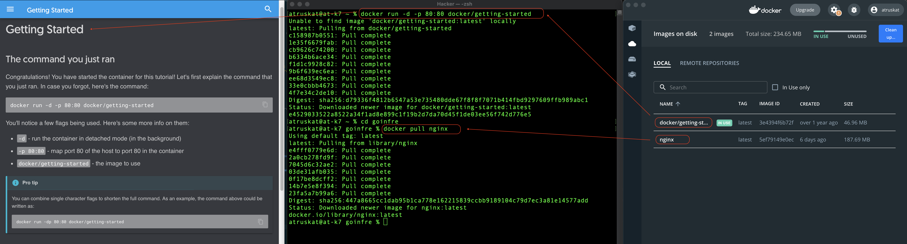
   *Caption: Output of `docker pull nginx` command showing the image being downloaded.*

2. **Check for the Docker Image**
   - Command: `docker images`
   - 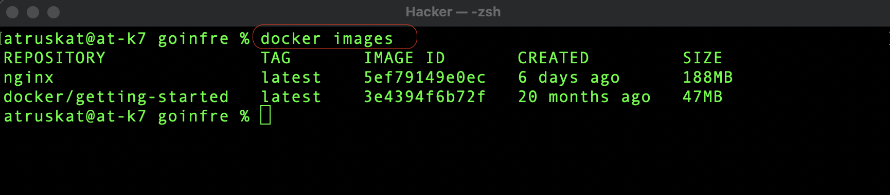
   *Caption: List of Docker images, including the `nginx` image.*

3. **Run the Docker Image**
   - Command: `docker run -d [nginx id]`
   - 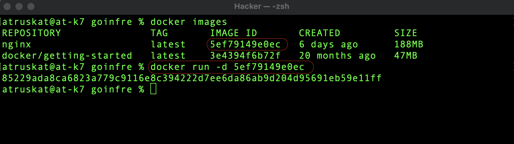
   *Caption: Output of `docker run -d nginx` command showing the container ID.*

4. **Verify the Running Container**
   - Command: `docker ps`
   - 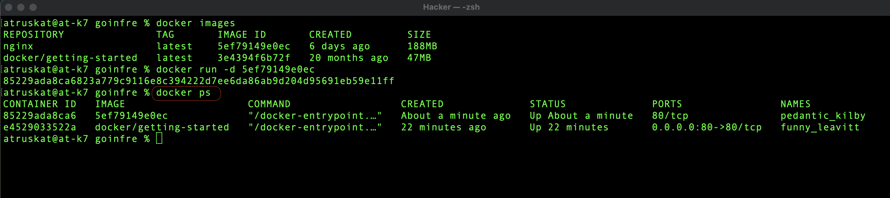
   *Caption: List of running Docker containers, showing the `nginx` container.*

5. **Inspect the Container**

        docker system df -v | grep nginx

        docker inspect 85229ada8ca6 | grep -oE '"IPAddress": "[0-9.]+"' | grep -oE '[0-9.]+'

        docker inspect -f '{{range $p, $conf := .Config.ExposedPorts}} {{$p}} {{end}}' 85229ada8ca6

   - Command: `docker inspect [container_id]` (replace `[container_id]` with the actual container ID)
   - 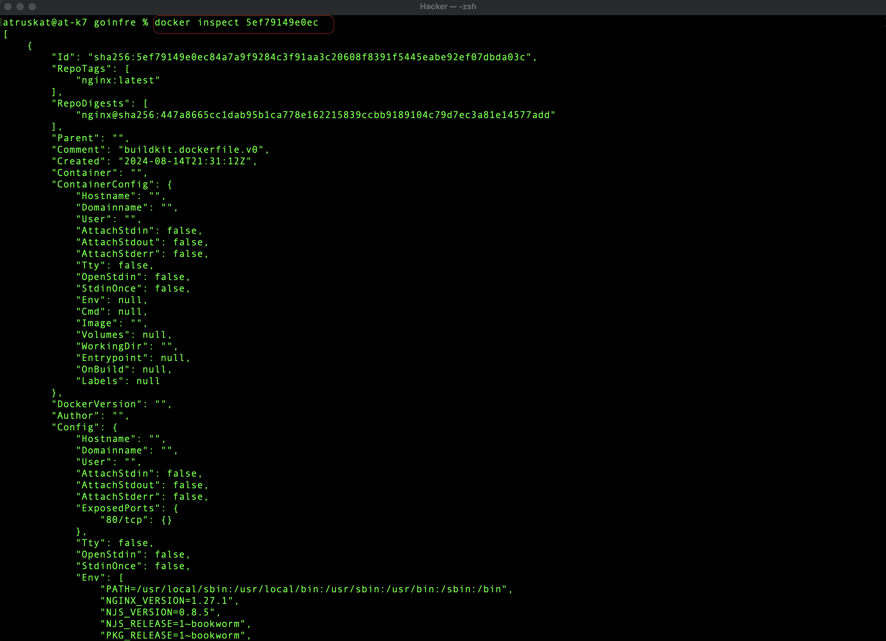
   - 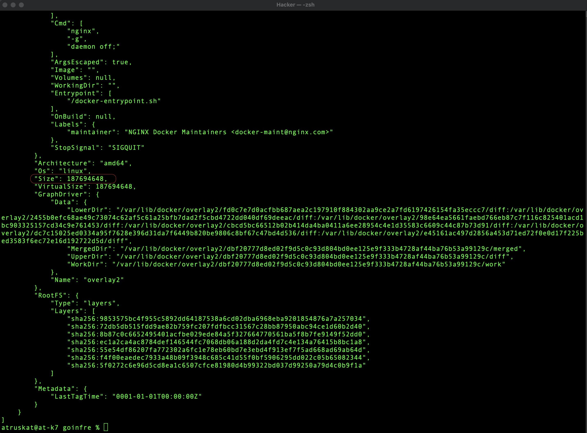
   - 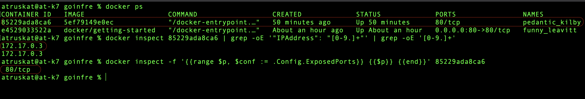
   *Caption: Output of `docker inspect` command showing container details including size, mapped ports, and IP address.*

6. **Stop the Docker Container**
   - Command: `docker stop [container_id]`
   - 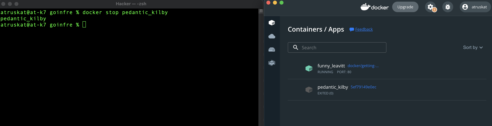
   *Caption: Output of `docker stop` command showing the container being stopped.*

7. **Verify the Container is Stopped**
   - Command: `docker ps`
   - 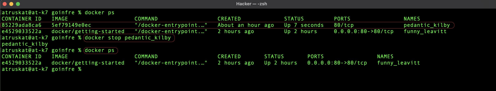
   *Caption: List of running Docker containers showing that the container is no longer running.*

8. **Run Docker with Mapped Ports**
   - Command: `docker run -d -p 80:80 -p 443:443 nginx`
   - 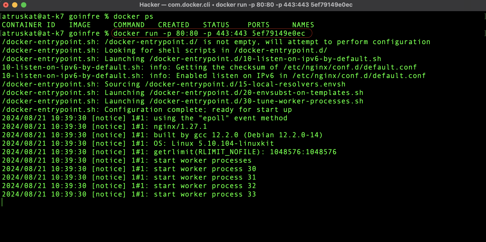
   - 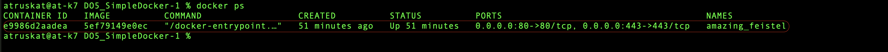
   *Caption: Output of `docker run -d -p 80:80 -p 443:443 nginx` command showing port mappings.*

9. **Verify Nginx Start Page**
   - Open a web browser and go to `http://localhost:80`
   - 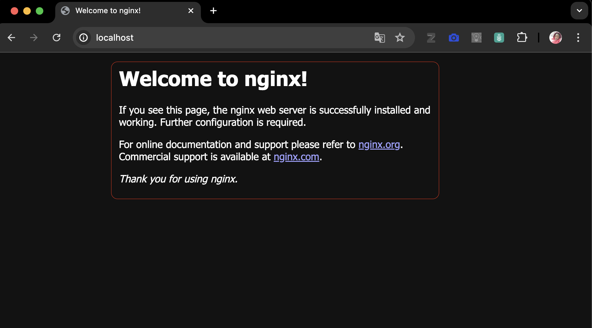
   *Caption: Browser showing the Nginx start page at `localhost:80`.*

10. **Restart the Docker Container**
    - Command: `docker restart [container_id]`
    - 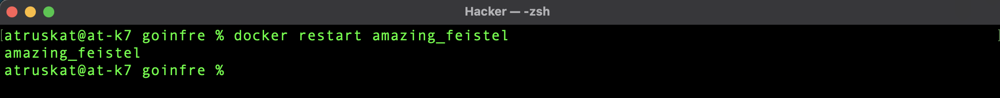
    *Caption: Output of `docker restart` command showing the container being restarted.*

11. **Verify the Container is Running**
    - Command: `docker ps`
    - 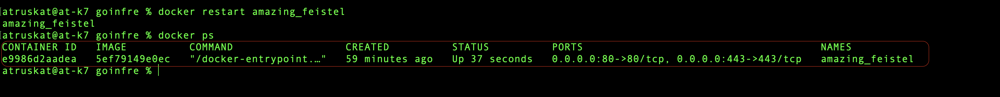
    *Caption: List of running Docker containers showing that the container is running.*


---

### Part 2. Operations with Container

#### 1. Read the `nginx.conf` Configuration File

- **Command:**
  ```bash
  docker exec [container_id|container_name] cat /etc/nginx/nginx.conf
  ```
  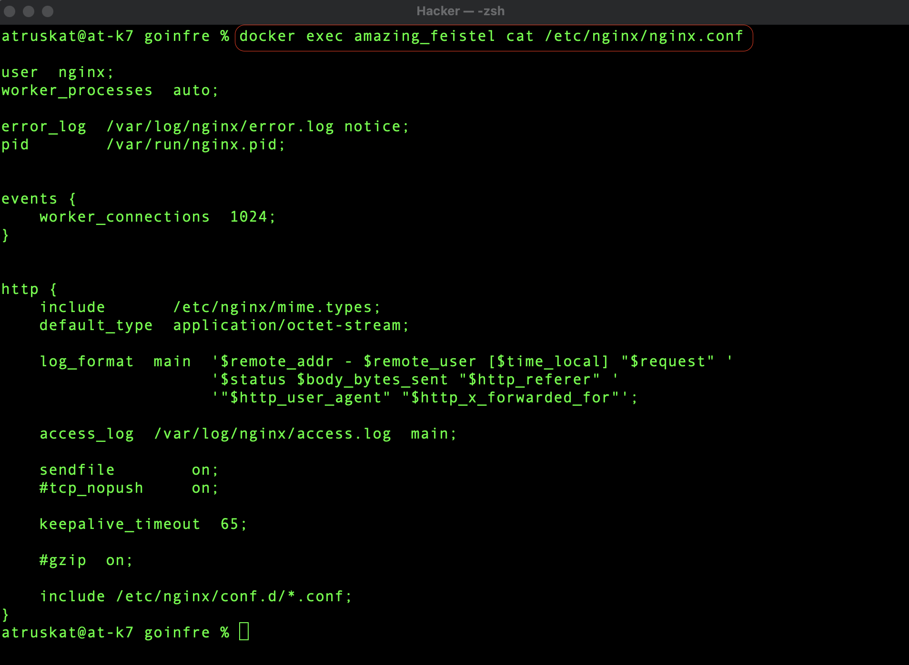
  *Caption: Output of reading the `nginx.conf` file inside the container.*

#### 2. Create a `nginx.conf` File on Local Machine and Configure it on the */status* path to return the **nginx** server status page.

- **Contents of `nginx.conf`:**

  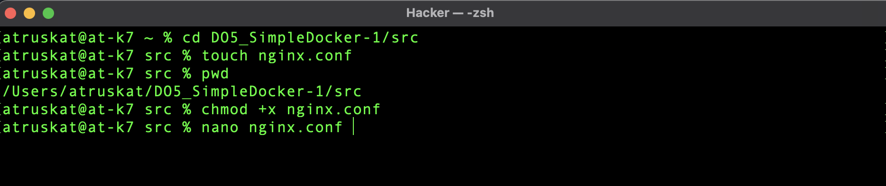
  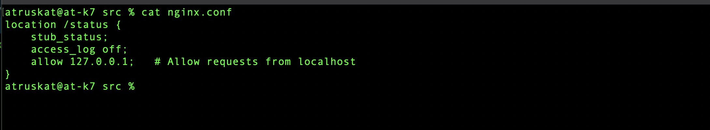
  *Caption: Contents of the `nginx.conf` file created on the local machine.*

#### 3. Copy `nginx.conf` File into Docker Image

- **Command:**
  ```bash
  docker cp nginx.conf [container_id|container_name]:/etc/nginx/nginx.conf
  ```
  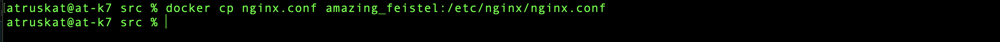
  *Caption: Command and output for copying `nginx.conf` into the container.*

#### 4. Restart Nginx Inside the Docker Container

- **Command:**
  ```bash
  docker exec [container_id|container_name] nginx -s reload
  ```
  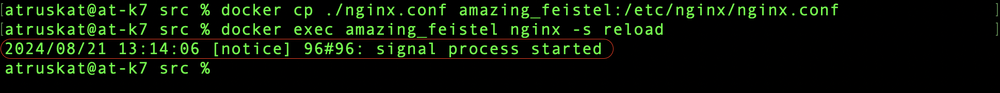
  *Caption: Command and output for restarting Nginx inside the container.*

#### 5. Verify Nginx Status Page

- **Command:**
  Open `http://localhost:80/status` in the browser.

  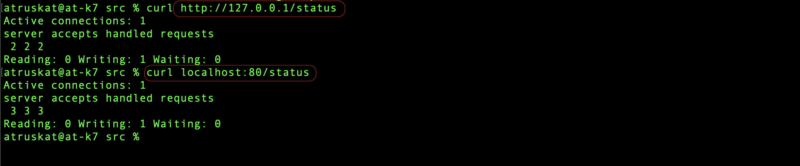
  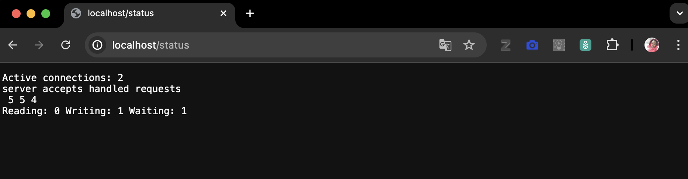
  *Caption: Nginx status page at `localhost:80/status`.*

#### 6. Export the Container to a `.tar` File

- **Command:**
  ```bash
  docker export [container_id|container_name] -o container.tar
  ```
  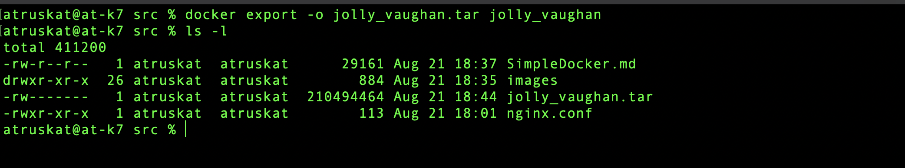
  *Caption: Command and output for exporting the container to `container.tar`.*

#### 7. Stop the Container

- **Command:**
  ```bash
  docker stop [container_id|container_name]
  ```
  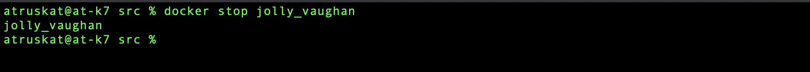
  *Caption: Command and output for stopping the container.*

#### 8. Delete the Image Without Removing the Container

- **Command:**
  ```bash
  docker rmi [image_id|repository]
  ```
  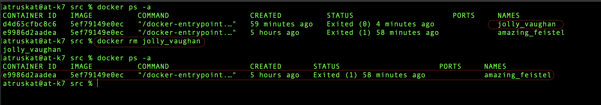
  *Caption: Command and output for deleting the image.*

#### 9. Delete the Stopped Container

- **Command:**
  ```bash
  docker rm [container_id|container_name]
  ```
  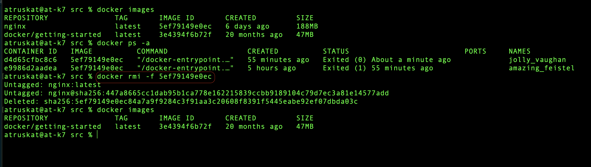
  *Caption: Command and output for deleting the stopped container.*

#### 10. Import the Container Back

- **Command:**
  ```bash
  cat container.tar | docker import - [new_image_name]
  ```
  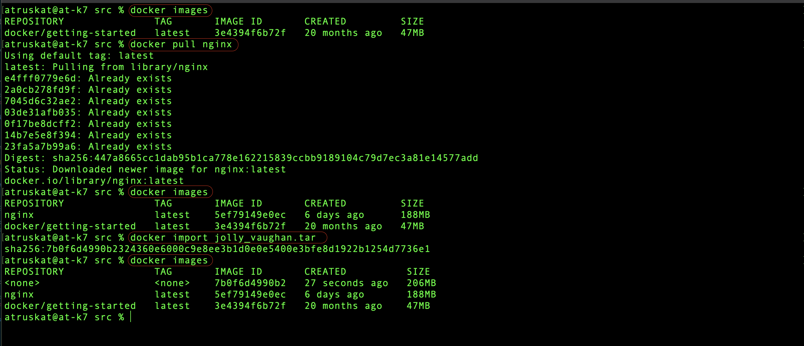
  *Caption: Command and output for importing the container from `container.tar`.*

#### 11. Run the Imported Container

- **Command:**
  ```bash
  docker run -d -p 80:80 [new_image_name]
  ```
  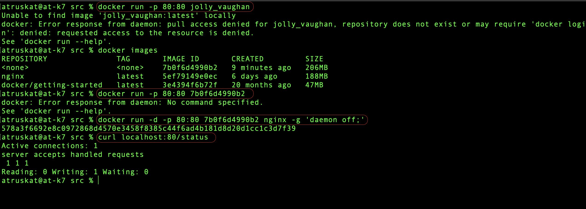
  *Caption: Command and output for running the imported container.*

#### 12. Verify Nginx Status Page Again

- **Command:**
  Open `http://localhost:80/status` in your browser.

  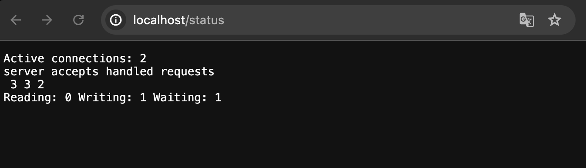
  *Caption: Nginx status page at `localhost:80/status` after importing the container.*


---
### Part 3. Mini Web Server

#### 1. Write a mini server in **C** and **FastCgi** that will return a simple page saying `Hello World!`.

    brew install nginx
    brew install fcgi
    brew install spawn-fcgi

- **C Code Example for Mini Server:**

  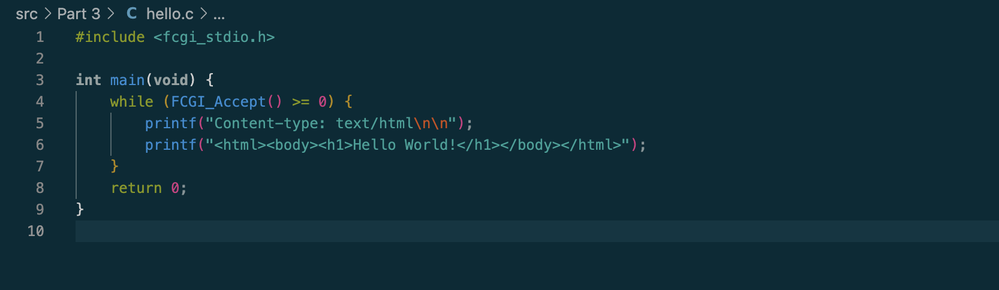
  *Caption: The C code for the mini server.*

- **Compilation Command:**
  ```bash
  gcc -o mini_server hello.c -I/Users/atruskat/.brew/Cellar/fcgi/2.4.2/include -L/Users/atruskat/.brew/Cellar/fcgi/2.4.2/lib -lfcgi
  ```

#### 2. Run the Mini Server via `spawn-fcgi` on Port 8080

- **Command to Start the Server:**
  ```bash
  spawn-fcgi -p 8080 -n ./mini_server
  ```

  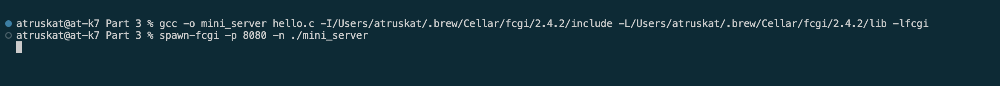
  *Caption: Command and output for running the mini server using `spawn-fcgi`.*

#### 3. Write an `nginx.conf` to Proxy Requests from Port 81 to `127.0.0.1:8080`

- **Contents of `nginx.conf`:**
  ```bash
  server {
        listen 81;
        server_name fcgiserver;

        location / {
            include fastcgi_params;
            fastcgi_pass 127.0.0.1:8080;
            fastcgi_index index.html;
        }
    }
  ```
  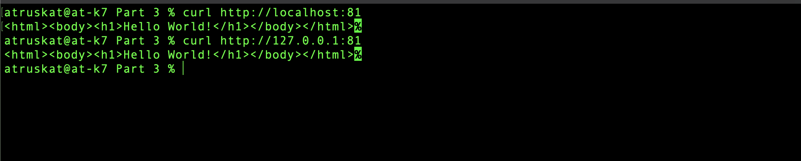
  *Caption: Contents of the `nginx.conf` file for proxying requests.*

#### 4. Check the Page in Browser on `localhost:81`

- **Command:**
  Open `http://localhost:81` in the browser.

  
  *Caption: Browser showing "Hello World!" page served by the mini server.*

#### 5. Place `nginx.conf` File Under `./nginx/nginx.conf`

- **File Path:**
  Make sure to place the `nginx.conf` file in the `./nginx/` directory.

  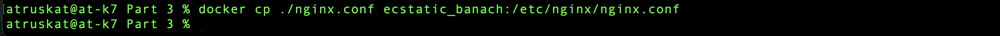
  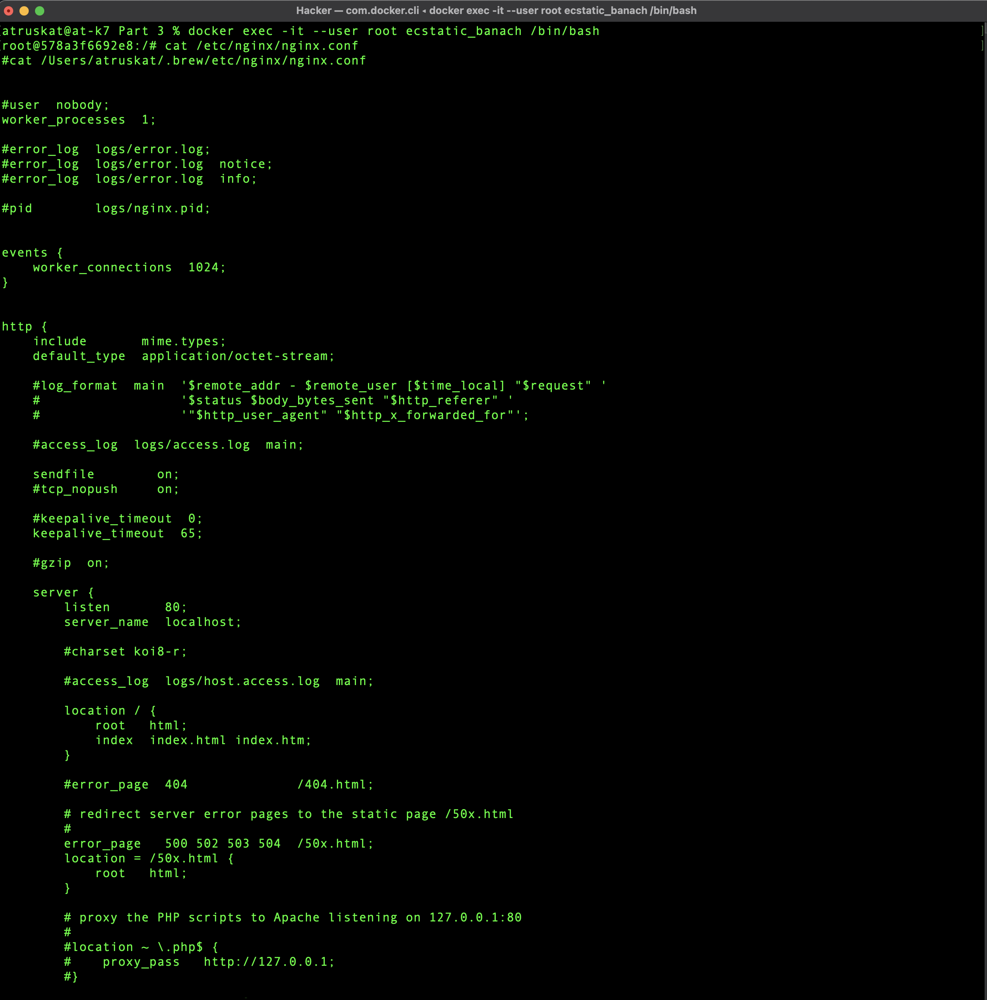
  *Caption: `nginx.conf` file located under `./nginx/` directory.*

---

### Part 4. Your Own Docker

#### 1. Write Dockerfile

- **Dockerfile:**

  ```dockerfile
  FROM nginx:latest

  USER root

  COPY ./hello.c /home/hello.c
  COPY ./start_point.sh /home/start_point.sh
  COPY ./nginx.conf /etc/nginx/nginx.conf

  RUN apt-get update && \
      apt-get install -y apt-utils && \
      apt-get upgrade -y && \
      apt-get install -y gcc spawn-fcgi libfcgi-dev;

  WORKDIR /home/

  ENTRYPOINT ["sh", "./start_point.sh"]
  ```

  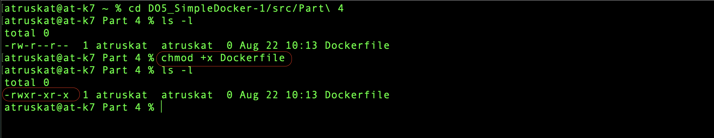
  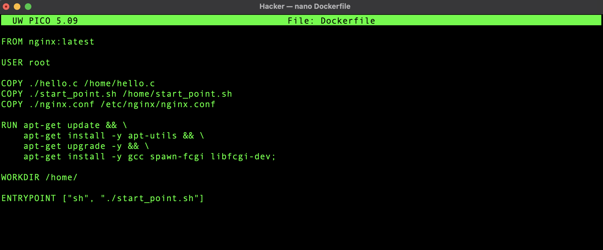
  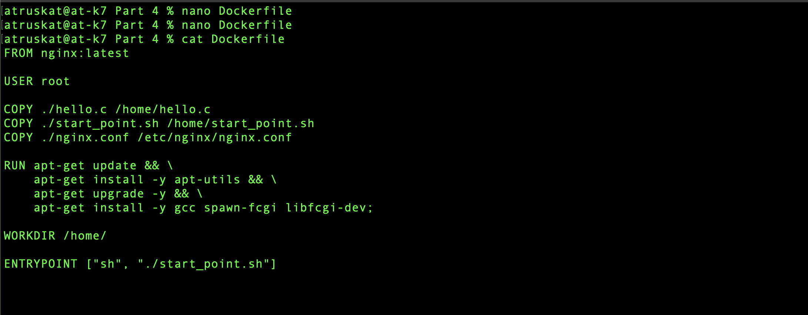
  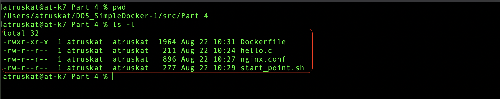
  *Caption: The Dockerfile used to build the Docker image for the mini server.*

#### 2. Build the Docker Image

- **Command:**
  ```bash
  docker build -t mini_server .
  ```

  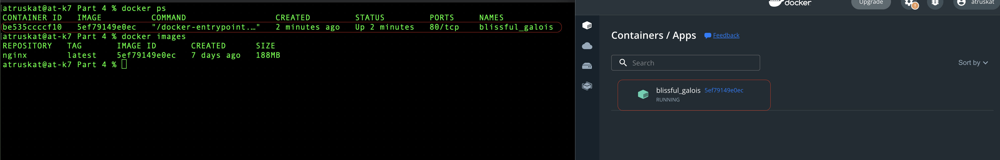
  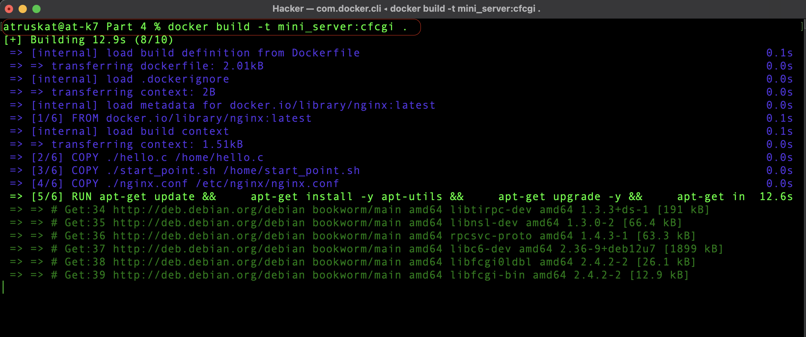
  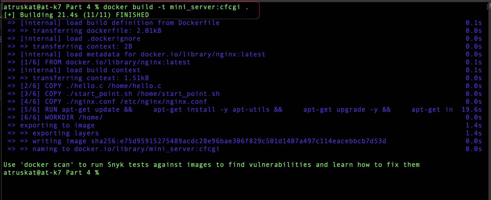
  *Caption: Command and output for building the Docker image.*

#### 3. Verify the Built Docker Image

- **Command:**
  ```bash
  docker images
  ```

  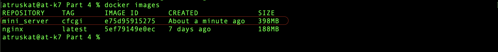
  *Caption: Output of `docker images` showing the built image.*

#### 4. Run the Docker Container

- **Command:**
  ```bash
  docker run -it --name atruskat -p 80:81 -v /Users/atruskat/DO5_SimpleDocker-1/src/Part\ 4/nginx.conf:/etc/nginx/nginx.conf -d mini_server:cfcgi bash
  ```

  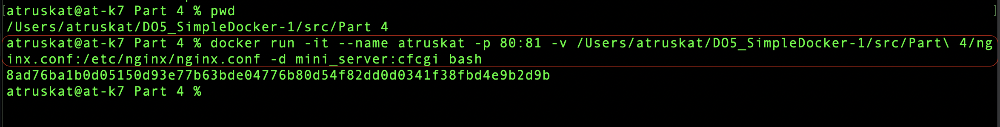
  *Caption: Command and output for running the Docker container with port mappings and volume.*

#### 5. Check the Mini Server Page on `localhost:80`

- **Command:**
  Open [http://localhost:80](http://localhost:80) in the browser.

  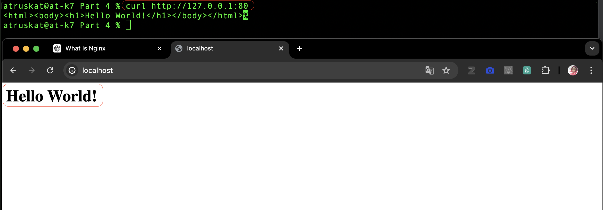
  *Caption: Browser showing the "Hello World!" page served by the mini server.*

#### 6. Add Proxying of `/status` Page in `nginx.conf`

- **Updated `nginx.conf` Contents:**
  ```nginx
  server {
        listen 81;
        server_name fcgiserver;
        location / {
            fastcgi_pass 127.0.0.1:8080;
        }
        location /status {
		    stub_status on;
		    access_log off;
            allow 127.0.0.1;
	    }
    }
  ```

  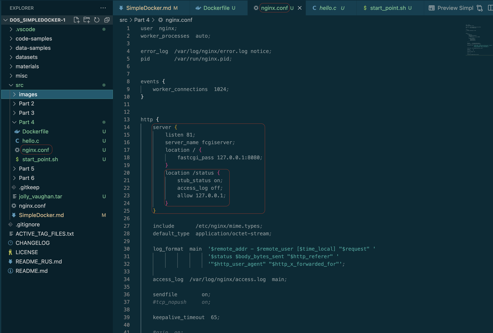
  *Caption: Updated `nginx.conf` with proxying and status page configuration.*

#### 7. Restart Docker Container

- **Command:**
  ```bash
  docker exec atruskat nginx -s reload
  ```

  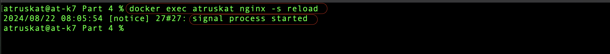
  *Caption: Command and output for restarting the Docker container.*

#### 8. Verify Nginx Status Page

- **Command:**
  Open [http://localhost:80/status](http://localhost:80/status) in your browser.

  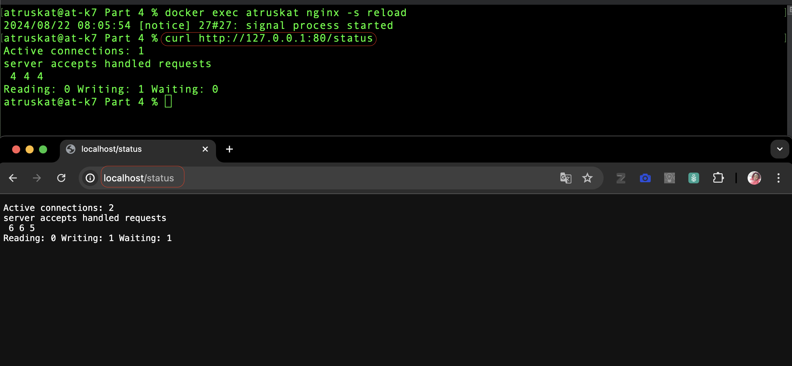
  *Caption: Nginx status page at `localhost:80/status` after restarting the container.*


---

### Part 5. **Dockle**

#### 1. Check the Image with Dockle

- **Command:**
  ```bash
  dockle [image_id|repository]
  ```

  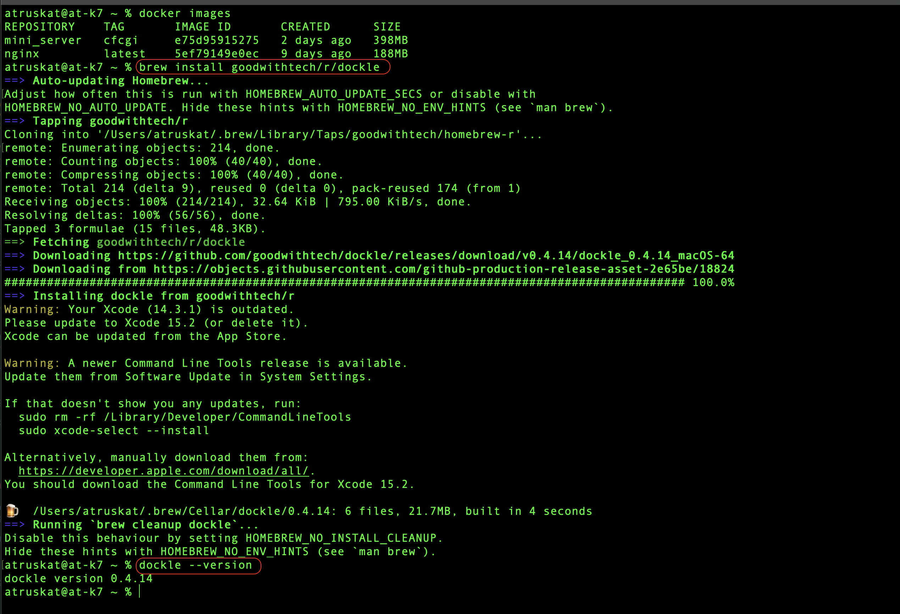
  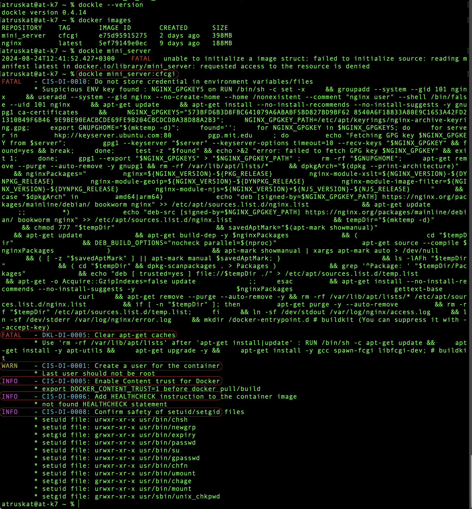
  *Caption: Output of running Dockle to check the Docker image for security issues.*

#### 2. Fix Issues Reported by Dockle

- **Steps to Fix Common Issues:**
  1. **Update Base Image:**
     - Check for updates to the base image used in the Dockerfile to ensure it includes the latest security patches.
     - Update the Dockerfile to use the updated base image and rebuild the Docker image.
  
  2. **Minimize Image Size:**
     - Remove unnecessary packages and files from the image to reduce the attack surface.
     - Use multi-stage builds to only include the necessary components in the final image.

  3. **Set Proper User Permissions:**
     - Avoid running processes as the root user inside the container.
     - Create and use a non-root user to run the application.

  4. **Scan for Vulnerabilities:**
     - Regularly scan the image for known vulnerabilities and update dependencies as needed.

  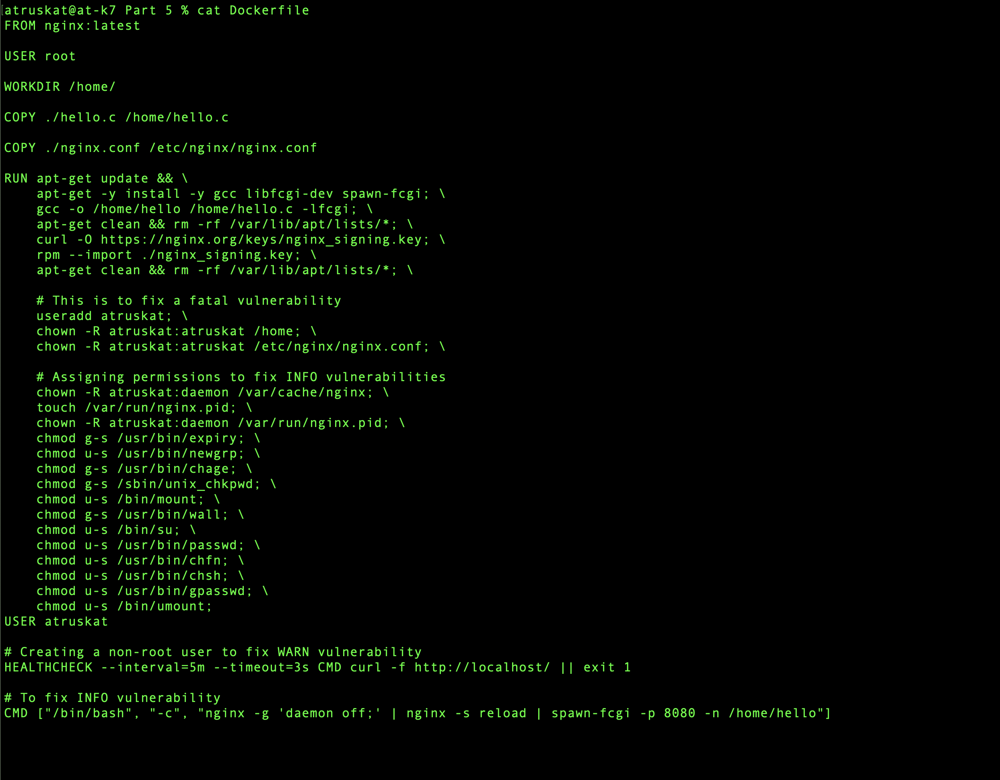
  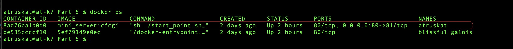
  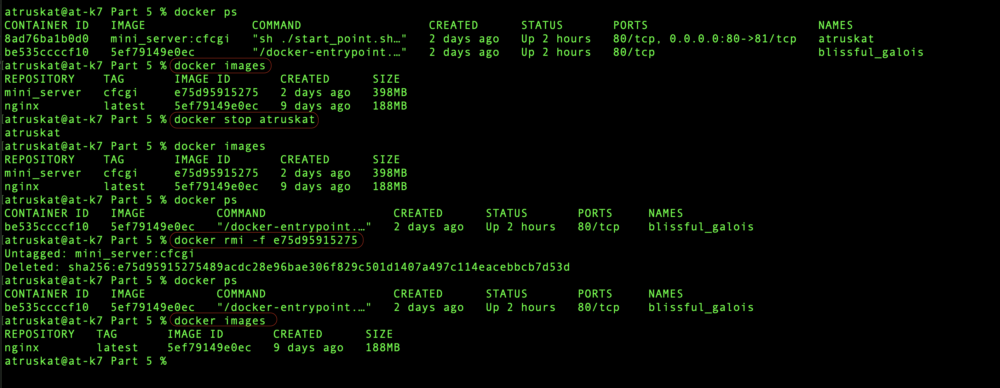
  


- **Rebuild Docker Image:**

  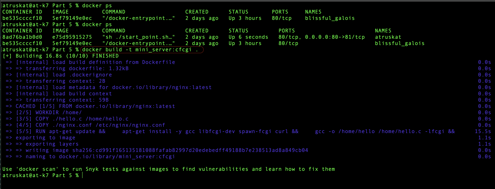
  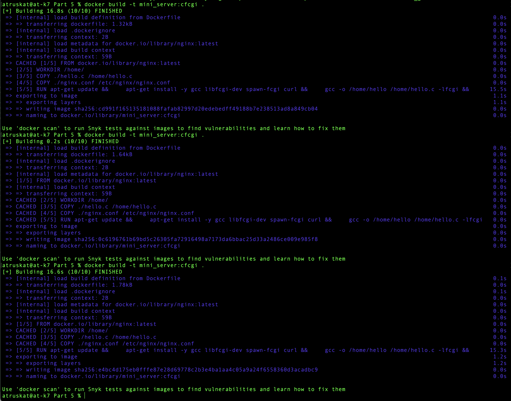
  *Caption: Updated Dockerfile with security improvements based on Dockle's recommendations.*

- **Recheck with Dockle:**

  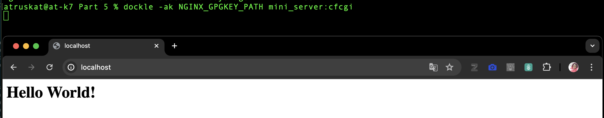
  *Caption: Output of Dockle after applying security fixes, showing no errors or warnings.*


---

### Part 6. Basic **Docker Compose**

#### 1. Create `docker-compose.yml`

- **File: `docker-compose.yml`**
  ```yaml
  version: '3'
  services:
    fastcgi_server:
      build:
        context: .
        dockerfile: Dockerfile
    nginx_proxy:
      image: nginx
      ports:
        - "80:8080"
      volumes:
        - ./nginx.conf:/etc/nginx/nginx.conf
      depends_on:
        - fastcgi_server
  ```

  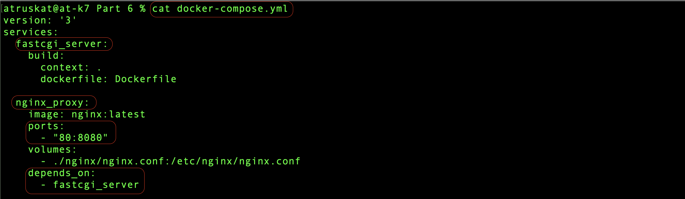
  *Caption: `docker-compose.yml` file for deploying FastCGI server and Nginx proxy.*

#### 2. Stop All Running Containers

  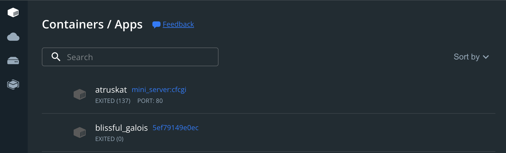
  *Caption: Stopping all currently running Docker containers.*

#### 3. Build and Run the Project

- **Commands:**
  ```bash
  docker-compose build
  docker-compose up -d
  ```

  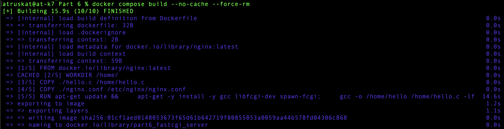
  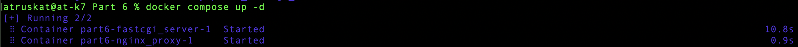
  *Caption: Output of `docker-compose build` and `docker-compose up` commands.*

#### 4. Verify the Deployment

- **Check Browser:**
  - Open your browser and navigate to `http://localhost:80`.

  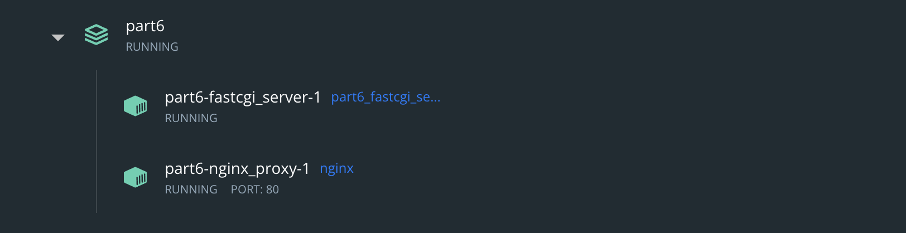
  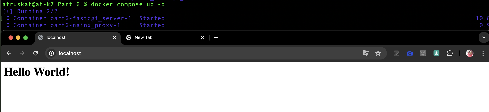
  *Caption: Browser showing the page served by the FastCGI server via Nginx proxy on `localhost:80`.*